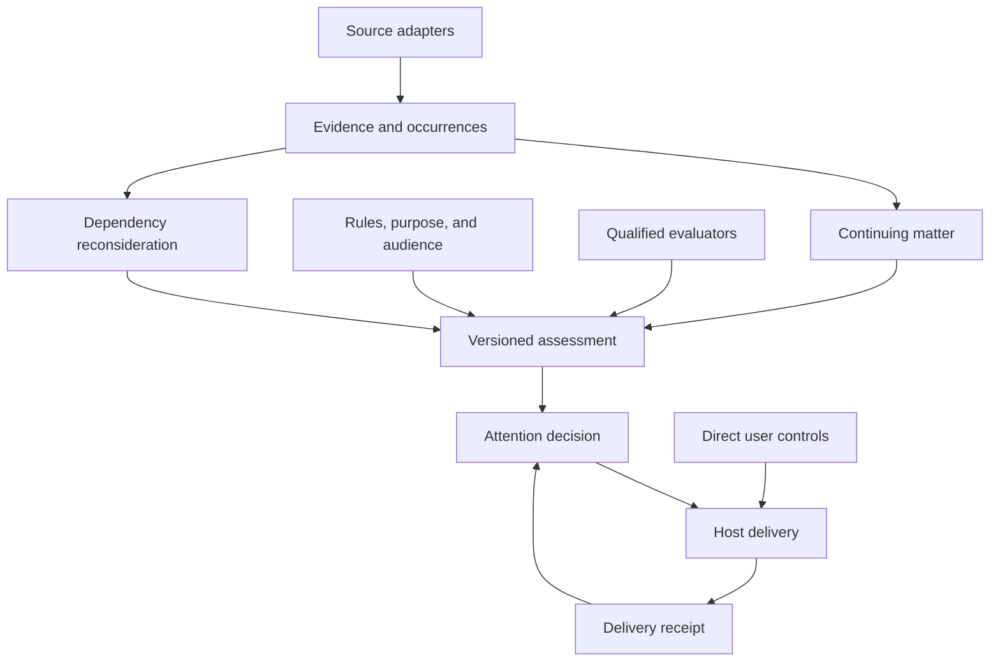

# Architecture

## Purpose and ownership

A matter gives a continuing subject stable identity and history. Assessments bind evidence, policy, purpose, audience context, and time. The core guarantees consistency and traceability while profiles define domain meaning.

The shared contracts and future reusable implementation live here. Oil is the first operational integration workload. StateCivics and crawler adapters contribute reviewed civic evidence and profile definitions. DIAT owns meeting fingerprints and speaker research. Provider-specific execution is an adapter behind the rule contract.

This is a target architecture. The scaffold provides planning tools and a limited deterministic walkthrough; MAT-002 adds the [portable structural and encoding boundary](contracts/schema-inventory.md), and MAT-003 adds [transactional persistence](storage.md). These components do not implement the whole graph.

## Boundaries

1. **Observation and occurrence:** transport redelivery, multiple reports of one event, recurrence, and independent corroboration have different meanings.
2. **Evidence and conclusions:** a source's statement is preserved separately from accepted state and derived judgments. Evidence relations name the claim and relevant time/scope.
3. **Matter and assessment:** identity survives revisions and sessions; policy and audience bind an assessment. Several assessments can coexist.
4. **Meaning and executor:** the semantic contract is portable. Qualification belongs to the concrete implementation, model, question, options, evidence preparation, and intended use.
5. **Attention and authority:** a useful contribution cannot create host permission or official authority. Current instructions and stop signals are handled directly.
6. **Eligibility and delivery:** pending output can become stale. Delivery, consumption, action, and verified outcome are separately evidenced.

## Dependency ownership

Declared inputs include source revisions, associations, rules, objective context, audience delivery baselines, coverage, and time conditions. Negative claims depend on the searched scope and coverage boundary, not only on returned documents. New eligible evidence or a timer can require reassessment without modifying a previously known document.

The store must preserve historic assessment receipts while distinguishing a current invalidated conclusion. Reusing a judgment is allowed only while its required inputs and qualification remain applicable. A code-tree evaluation run is evidence context, not the continuing matter's identity.

## Existing components

Use the [source map](source-map.md), [Oil profile](profiles/oil.md), and [semantic reuse map](reuse/semantic-evaluation.md). Existing clients, storage primitives, retrieval boundaries, and experimental evaluators should be inspected before extending them. The new shared core must not inherit a domain's vocabulary or accidentally claim its runtime guarantees.

## Implementation sequence

The [backlog](../tickets/INDEX.md) is the executable planning source. The intended progression is contracts and storage, deterministic lifecycle and replay, semantic shadow evaluation, domain adapters, comparable private experiments, and qualified release evidence. The dependency graph, rather than the numeric order of ticket IDs, determines readiness.
